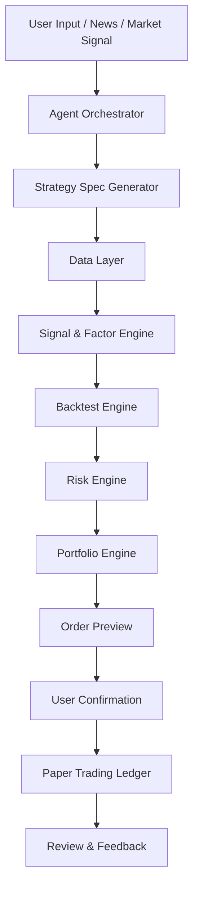

# StratPilot 需求文档

## 1. 项目定位

StratPilot 是一个面向 Flow AI / Bobby AI / RockFlow 黑客松的 Human-in-the-loop 投资交易 Agent 原型。

它不是一个好看的 AI 投资聊天助手，也不是一个全自动实盘交易机器人，而是一个能把用户投资想法、市场事件或交易需求转化为可计算、可回测、可风控、可确认执行的交易方案的 Agent 系统。

核心一句话：

> Agent 负责理解和编排，数据负责验证，回测负责检验，风控负责否决，用户保留最终交易确认权。

## 2. 背景与比赛判断

本次黑客松关注的是 24 小时内能否做出真正能跑的投资交易 Agent，而不是 PPT、概念或单纯聊天窗口。

项目必须证明一个真实投资场景中的关键能力：

- 能读取或模拟读取金融数据。
- 能发现或验证交易信号。
- 能生成结构化策略。
- 能跑历史回测。
- 能计算风险指标。
- 能给出仓位、调仓、平仓、回撤管理建议。
- 能在不满足条件时拒绝交易。
- 能让用户确认后进入模拟执行。

主办方 Bobby AI / RockFlow 的产品语境更偏港美股、ETF、期权、AI Portfolio、自然语言投资策略、回测组合与交易辅助。因此本项目优先面向港美股/ETF/期权策略，而不是纯币圈合约。

## 3. 项目名称

建议名称：

**StratPilot: Human-in-the-loop Strategy, Backtest & Risk Agent**

中文名称：

**StratPilot：港美股策略生成、回测验证与仓位风控 Agent**

## 4. 目标用户

目标用户不是“所有投资者”，而是：

- 有投资想法但缺少系统化验证能力的港美股投资者。
- 高频看盘但容易凭感觉交易的主动投资者。
- 想把新闻、主题、财报事件转成交易策略的用户。
- 需要组合仓位、回撤控制和再平衡建议的用户。
- 希望用自然语言生成可回测策略的 Bobby AI 类用户。

典型痛点：

- 有想法但不知道如何构建股票池。
- 不知道信号是否有效。
- 没有回测验证。
- 仓位随意。
- 止损和平仓规则不明确。
- 策略亏损后不知道哪里出了问题。

## 5. 产品核心价值

把“拍脑袋交易”变成：

> 投资假设 -> 数据验证 -> 信号计算 -> 策略生成 -> 回测评估 -> 风控否决 -> 仓位建议 -> 用户确认 -> 模拟执行 -> 复盘反馈

项目不承诺赚钱，但承诺交易决策过程可解释、可回测、可风控、可复盘。

## 6. 关键原则

### 6.1 Human-in-the-loop

Agent 不允许擅自实盘下单。

Agent 可以：

- 解析用户意图。
- 发现市场机会。
- 生成策略方案。
- 调用数据。
- 跑回测。
- 计算风险。
- 给出仓位建议。
- 生成模拟订单。

但最终交易前必须经过用户确认。

用户可选择：

- Confirm: 确认模拟执行。
- Modify: 修改风险参数或仓位。
- Re-run Backtest: 重新回测。
- Reject: 拒绝交易。

### 6.2 LLM 不直接决定买卖

LLM 只负责理解、编排、解释和生成结构化配置。

以下动作必须由确定性代码执行：

- 因子计算。
- 信号生成。
- 回测。
- 最大回撤计算。
- 夏普计算。
- 仓位分配。
- 风控阈值判断。
- 是否允许交易。
- 模拟订单生成。

### 6.3 风控有否决权

Agent 必须支持三种结论：

- Buy / Long / Build Portfolio: 可以交易。
- Watch / Wait: 观察等待。
- Reject / No Trade: 拒绝交易。

拒绝交易是核心加分点。系统应在以下情况拒绝：

- 回测最大回撤超过用户限制。
- 策略样本交易次数过少。
- 夏普过低。
- 策略跑输基准且无风险收益优势。
- 波动率过高。
- 流动性不足。
- 信号互相冲突。
- 当前市场 regime 不适合该策略。

## 7. MVP 范围

24 小时黑客松版本只做一个完整闭环，不做大而全平台。

### 7.1 必须完成

- 自然语言输入投资想法。
- 解析投资主题、风险偏好、基准、回撤限制。
- 构建固定或半自动股票池。
- 选择策略模板。
- 计算因子和信号。
- 执行历史回测。
- 输出回测指标。
- 执行风控检查。
- 输出仓位建议。
- 生成模拟订单。
- 用户确认后记录模拟持仓。
- 展示交易日志和策略解释。

### 7.2 可选增强

- 通过 QVeris 调用实时或历史数据。
- 新闻事件输入。
- 期权保护策略建议。
- 多策略对比。
- 参数微调后重新回测。
- QuantStats 报告。
- 风险贡献图。

### 7.3 不做

- 不做真实券商下单。
- 不做全市场全资产全策略。
- 不做完全无人值守自动交易。
- 不做高频交易。
- 不承诺真实收益。
- 不让 LLM 自由生成不可验证交易建议。

## 8. 推荐技术栈

### 8.1 前端

- Next.js / React。
- 左侧聊天输入。
- 右侧策略结果面板。
- 回测曲线图。
- 持仓权重表。
- 风控检查结果。
- 模拟订单确认按钮。

### 8.2 后端

- Python FastAPI。
- Pandas / NumPy。
- yfinance 作为降级数据源。
- QVeris 作为可选统一金融数据能力入口。
- vectorbt 或自写 Pandas 回测引擎。
- PyPortfolioOpt 或 Riskfolio-Lib 做组合权重优化。
- QuantStats 可选做报告。

### 8.3 数据层

优先级：

1. 本地缓存数据，确保演示稳定。
2. QVeris API，作为比赛数据能力入口。
3. yfinance，作为免费降级源。
4. 手工样例数据，作为完全离线 Demo。

## 9. 系统架构



## 10. 核心模块拆解

### 10.1 Agent Orchestrator

职责：

- 理解用户自然语言。
- 识别投资主题。
- 识别风险偏好。
- 识别投资期限。
- 选择策略模板。
- 生成结构化策略配置。
- 调用后端工具。
- 汇总解释结果。

Agent 输入示例：

```text
我想做一个 AI 芯片和云计算相关的美股组合，希望跑赢 QQQ，但最大回撤不要超过 15%。
```

Agent 输出结构：

```json
{
  "asset_class": "US_STOCK",
  "theme": "AI_chips_and_cloud",
  "objective": "outperform_benchmark",
  "benchmark": "QQQ",
  "risk_preference": "medium",
  "max_drawdown": 0.15,
  "horizon": "swing_to_mid_term",
  "strategy_template": "cross_sectional_multifactor"
}
```

### 10.2 Strategy Spec Generator

职责：

把用户想法转成标准策略配置。

策略配置示例：

```json
{
  "strategy_name": "AI_Chip_Momentum_Risk_Control",
  "universe": ["NVDA", "AMD", "AVGO", "TSM", "ARM", "SMCI", "MU", "ASML", "MSFT", "GOOGL", "AMZN", "QQQ"],
  "benchmark": "QQQ",
  "timeframe": "1d",
  "lookback_period": "3y",
  "rebalance_frequency": "weekly",
  "min_holding_days": 5,
  "factors": [
    "momentum_20d",
    "momentum_60d",
    "trend_ma60",
    "volume_strength_20d",
    "volatility_20d",
    "drawdown_60d",
    "relative_strength_vs_benchmark"
  ],
  "entry_rule": "rank_top_n_and_above_ma60",
  "exit_rule": "rank_drop_or_stop_loss_or_below_ma60",
  "position_sizing": "inverse_volatility_weighted",
  "risk_limits": {
    "max_single_weight": 0.2,
    "max_portfolio_drawdown": 0.15,
    "drawdown_de_risk": 0.1,
    "stop_loss": 0.08,
    "cash_buffer": 0.1,
    "max_turnover_per_rebalance": 0.4
  }
}
```

### 10.3 Data Layer

职责：

- 统一获取价格、成交量、财报、新闻、期权等数据。
- 支持在线和离线模式。
- 输出标准 DataFrame。

MVP 价格数据字段：

- date
- symbol
- open
- high
- low
- close
- adjusted_close
- volume

数据要求：

- 至少 2 年日线数据。
- 缺失比例小于 5%。
- 支持基准 QQQ/SPY。
- 支持本地缓存。

QVeris 使用方式：

- 开发阶段用 `/search` 搜索能力。
- 用 `/tools/by-ids` 固定 schema。
- Demo 阶段固定 tool_id。
- 所有 API 失败时使用本地缓存。

### 10.4 Universe Builder

职责：

构建资产池。

支持三种方式：

1. 固定主题映射：
   - AI chips: NVDA, AMD, AVGO, TSM, ARM, SMCI, MU, ASML
   - Cloud: MSFT, GOOGL, AMZN, META
   - ETF: QQQ, SPY, SMH, SOXX, XLK

2. 用户指定：
   - 用户直接输入股票列表。

3. 数据筛选：
   - 流动性过滤。
   - 历史覆盖过滤。
   - 波动异常过滤。

### 10.5 Factor Engine

职责：

计算可解释因子。

MVP 因子：

| 因子 | 计算方式 | 含义 |
| --- | --- | --- |
| momentum_20d | close / close.shift(20) - 1 | 短期动量 |
| momentum_60d | close / close.shift(60) - 1 | 中期动量 |
| trend_ma60 | close / MA60 - 1 | 趋势强弱 |
| volume_strength_20d | volume / volume.rolling(20).mean() | 放量程度 |
| volatility_20d | daily_return.rolling(20).std() | 近期波动 |
| drawdown_60d | close / rolling_max_60d - 1 | 近期回撤 |
| relative_strength | stock_return_60d - benchmark_return_60d | 相对强弱 |

横截面评分：

```text
score =
  0.30 * zscore(momentum_60d)
+ 0.20 * zscore(momentum_20d)
+ 0.20 * zscore(trend_ma60)
+ 0.10 * zscore(volume_strength_20d)
- 0.10 * zscore(volatility_20d)
- 0.10 * zscore(abs(drawdown_60d))
```

注意：

- 所有因子必须只使用当日及以前数据。
- 回测中交易价格应使用下一交易日开盘价或下一根 bar，避免未来函数。

### 10.6 Strategy Engine

职责：

根据策略配置生成目标持仓。

MVP 策略模板：

1. Cross-sectional Multi-factor Strategy
   - 每周计算因子。
   - 选择 score Top N。
   - 要求 close > MA60。
   - 按风险倒数分配权重。

2. ETF Momentum Rotation
   - 资产池：SPY, QQQ, TLT, GLD, XLK, SMH。
   - 选择 3/6/12 个月动量最强资产。
   - 若 SPY/QQQ 跌破 MA120，则提高现金权重。

3. Protective Option Suggestion
   - 仅生成期权保护建议，不执行。
   - 示例：protective put / collar。
   - 需要用户已有持仓或模拟组合。

### 10.7 Entry Rules

开仓条件必须硬编码。

横截面策略开仓规则：

```text
每周一收盘后计算因子；
选择 score Top 5；
候选股票必须满足：
1. close > MA60
2. 数据完整
3. 20日平均成交量大于阈值
4. 波动率未超过阈值
5. 当前组合未触发回撤风控
下一交易日开盘模拟买入。
```

### 10.8 Exit Rules

平仓条件：

```text
满足任一条件则卖出：
1. score 排名跌出 Top 8
2. close < MA60
3. 单票亏损超过 8%
4. 个股从 60 日高点回撤超过 15%
5. 组合回撤触发降仓或清仓
6. 用户手动拒绝继续持有
```

### 10.9 Rebalance Rules

调仓规则：

```text
调仓频率：weekly
最小持仓期：5 个交易日
最大单次换手率：40%
新入选股票可设置连续 2 次进入 Top 5 才建仓
跌出 Top 8 才剔除，降低频繁换仓
```

### 10.10 Portfolio Engine

职责：

计算目标权重。

MVP 支持三种权重方式：

1. Equal Weight
   - Top 5 等权。
   - 保留 10% 现金。

2. Inverse Volatility Weight
   - 波动越低权重越高。

```text
raw_weight_i = 1 / volatility_i
weight_i = raw_weight_i / sum(raw_weight)
weight_i = min(weight_i, max_single_weight)
```

3. Risk De-risking
   - 回撤超过 10%，总仓位降至 50%。
   - 回撤超过 15%，总仓位降至 0%，策略暂停。

### 10.11 Risk Engine

职责：

- 风控检查。
- 风险否决。
- 仓位调整。
- 生成风险解释。

硬风控：

| 风控项 | 默认规则 |
| --- | --- |
| 单票上限 | 20% |
| 现金缓冲 | 10% |
| 组合回撤降仓 | 10% |
| 组合回撤清仓 | 15% |
| 单票止损 | 8% |
| 最大单次换手 | 40% |
| 最小交易次数 | 回测交易少于 10 次则警告 |
| 夏普阈值 | 低于 0.5 则高风险 |
| 流动性过滤 | 成交量/成交额不足则剔除 |

风险判断输出：

```json
{
  "allow_trade": false,
  "decision": "REJECT",
  "reasons": [
    "Backtest max drawdown 22.3% exceeds user limit 15%",
    "Sharpe ratio 0.42 is below threshold 0.5"
  ],
  "suggested_action": "Reduce concentration and re-run backtest"
}
```

### 10.12 Backtest Engine

职责：

模拟策略历史表现。

必须模拟：

- 初始资金。
- 现金。
- 持仓数量。
- 买入价格。
- 卖出价格。
- 手续费。
- 滑点。
- 每日净值。
- 调仓。
- 止损。
- 降仓。
- 交易日志。

默认参数：

```json
{
  "initial_cash": 100000,
  "commission_rate": 0.0005,
  "slippage_rate": 0.0005,
  "execution_price": "next_open",
  "benchmark": "QQQ",
  "rebalance_frequency": "weekly"
}
```

回测主循环伪代码：

```python
for date in trading_days:
    update_market_value(date)
    update_drawdown(date)

    if risk_triggered(date):
        reduce_or_close_positions(date)
        log_risk_action(date)

    if is_rebalance_day(date):
        factors = compute_factors(data_until_date)
        scores = rank_stocks(factors)
        target_positions = generate_target_positions(scores)
        target_positions = apply_risk_limits(target_positions)
        execute_rebalance(target_positions, next_open_price)

    record_daily_nav(date)
```

关键要求：

- 不允许未来函数。
- 不能用调仓日之后的数据算调仓日信号。
- 交易应发生在下一交易日开盘或下一根 bar。
- 手续费和滑点必须计入。

### 10.13 Backtest Metrics

输出指标：

| 指标 | 说明 |
| --- | --- |
| total_return | 总收益 |
| annual_return | 年化收益 |
| benchmark_return | 基准收益 |
| excess_return | 超额收益 |
| max_drawdown | 最大回撤 |
| annual_volatility | 年化波动 |
| sharpe_ratio | 夏普比率 |
| calmar_ratio | 年化收益 / 最大回撤 |
| win_rate | 胜率 |
| profit_loss_ratio | 盈亏比 |
| turnover | 换手率 |
| number_of_trades | 交易次数 |
| best_trade | 最佳交易 |
| worst_trade | 最差交易 |

策略评分：

```text
strategy_score =
  0.30 * annual_return_score
+ 0.25 * max_drawdown_score
+ 0.20 * sharpe_score
+ 0.10 * win_rate_score
+ 0.10 * turnover_score
+ 0.05 * stability_score
```

硬否决：

```text
if max_drawdown > user_limit:
    reject_strategy

if number_of_trades < 10:
    warn_insufficient_samples

if annual_return < benchmark_return:
    mark_as_underperform

if sharpe < 0.5:
    warn_high_risk
```

### 10.14 Order Preview

职责：

生成模拟订单，不直接实盘下单。

订单字段：

- symbol
- side
- target_weight
- estimated_price
- estimated_quantity
- estimated_notional
- stop_loss
- take_profit optional
- reason

示例：

```json
[
  {
    "symbol": "NVDA",
    "side": "BUY",
    "target_weight": 0.15,
    "estimated_notional": 15000,
    "stop_loss": 0.08,
    "reason": "Top factor score, above MA60, strong relative momentum"
  }
]
```

### 10.15 Paper Trading Ledger

职责：

- 记录用户确认后的模拟交易。
- 记录持仓。
- 记录现金。
- 记录净值变化。
- 记录每次策略决策原因。

需要表：

- strategies
- backtests
- orders
- positions
- portfolio_snapshots
- audit_logs

## 11. API 设计建议

### 11.1 POST /api/agent/plan

输入用户自然语言，输出结构化策略配置。

### 11.2 POST /api/strategy/backtest

输入策略配置，输出回测结果。

### 11.3 POST /api/risk/evaluate

输入回测结果和用户风险约束，输出是否允许交易。

### 11.4 POST /api/portfolio/allocate

输入候选标的和风险数据，输出目标权重。

### 11.5 POST /api/orders/preview

输入目标权重，输出模拟订单。

### 11.6 POST /api/orders/confirm

用户确认模拟执行，写入 paper trading ledger。

### 11.7 GET /api/portfolio/status

返回当前模拟持仓、现金、净值、回撤。

## 12. 前端页面需求

### 12.1 主页面布局

左侧：

- 聊天输入框。
- 用户投资想法。
- Agent 解释。
- 确认/修改/拒绝按钮。

右侧：

- 策略摘要卡。
- 股票池。
- 因子排名表。
- 回测净值曲线。
- 回撤曲线。
- 风险检查结果。
- 推荐仓位。
- 模拟订单。

### 12.2 必须展示的结果

- 投资意图解析。
- 选择的策略模板。
- 使用的数据源。
- 回测区间。
- 总收益。
- 年化收益。
- 最大回撤。
- 夏普。
- 基准对比。
- 风控是否通过。
- 建议仓位。
- 退出规则。
- 用户确认按钮。

## 13. Demo 场景

### 场景 1：主题组合策略

用户输入：

```text
我想做一个 AI 芯片和云计算相关的美股组合，希望跑赢 QQQ，但最大回撤不要超过 15%。
```

系统输出：

- 股票池：NVDA, AMD, AVGO, TSM, ARM, SMCI, MU, ASML, MSFT, GOOGL, AMZN, QQQ。
- 策略：横截面多因子 + 趋势过滤 + 回撤控制。
- 回测：近 3 年。
- 风控：通过或拒绝。
- 仓位：Top 5 + QQQ + cash。
- 退出：组合回撤 10% 降仓，15% 清仓。

### 场景 2：新闻事件驱动

用户输入：

```text
英伟达发布新一代 AI 芯片，市场认为供应链订单可能超预期。这个新闻能不能转成交易机会？
```

系统输出：

- 事件识别：AI 芯片利好。
- 影响资产：NVDA, AMD, TSM, AVGO, SMCI, ARM。
- 策略：事件后动量 + 相对强弱排序。
- 回测：用历史价格模拟事件后趋势策略。
- 风控：如果估值/波动过高则建议观察。

### 场景 3：风险否决

用户输入：

```text
我想满仓买入最近涨得最强的 AI 股票。
```

系统输出：

- 识别为激进集中交易。
- 回测显示回撤超过阈值。
- 结论：拒绝满仓交易。
- 建议：降低单票上限，加入 ETF，保留现金，重新回测。

## 14. 降级方案

必须准备三层演示模式：

1. Online Mode
   - QVeris / yfinance 实时获取数据。

2. Cached Mode
   - 使用提前缓存的价格数据。

3. Offline Demo Mode
   - 使用内置 CSV 和固定样例，完全断网也能跑完整流程。

系统启动时应自动检测：

- API key 是否存在。
- 网络是否可用。
- 本地缓存是否存在。

如果在线失败，自动切换到缓存。

## 15. 安全与密钥

所有 API key 必须从环境变量读取。

不得写入前端代码。
不得提交到 GitHub。
不得写进日志。

环境变量示例：

```bash
QVERIS_API_KEY=
VOLC_ACCESS_KEY_ID=
VOLC_SECRET_ACCESS_KEY=
OPENAI_API_KEY=
```

## 16. 实现优先级

### P0

- 策略配置结构。
- 固定股票池。
- 本地或 yfinance 价格数据。
- 横截面因子计算。
- 简化回测。
- 风控否决。
- 仓位建议。
- 前端结果展示。

### P1

- QVeris 数据接入。
- 用户确认模拟订单。
- 交易日志。
- 多策略模板。
- 参数调节。

### P2

- 新闻事件输入。
- 期权保护建议。
- QuantStats 报告。
- 风险贡献分析。
- 多轮复盘优化。

## 17. 验收标准

项目完成时必须可以演示：

1. 输入一句投资想法。
2. Agent 生成结构化策略配置。
3. 系统拉取或读取价格数据。
4. 系统计算因子和排名。
5. 系统执行回测。
6. 系统输出收益、回撤、夏普、基准对比。
7. 系统执行风控检查。
8. 系统给出允许交易或拒绝交易结论。
9. 系统输出仓位建议和退出规则。
10. 用户确认后生成模拟订单。

最低验收输入：

```text
我想做一个 AI 芯片和云计算相关的美股组合，希望跑赢 QQQ，但最大回撤不要超过 15%。
```

最低验收输出：

```text
结论：可以小仓执行 / 不建议执行 / 需要重新调参

原因：
1. 回测年化收益 xx%，基准 QQQ 为 xx%
2. 最大回撤 xx%，用户限制为 15%
3. 夏普 xx
4. 当前建议总仓位 xx%

建议组合：
NVDA xx%
AVGO xx%
TSM xx%
MSFT xx%
QQQ xx%
Cash xx%

退出规则：
- 组合回撤超过 10%，降仓一半
- 超过 15%，清仓并暂停策略
- 个股跌破 MA60 或亏损超过 8%，剔除
```

## 18. 上台表述

推荐上台总结：

> StratPilot 不是一个会聊天的投资助手，也不是让大模型自由炒股。它把用户的一句投资想法转成受规则约束的策略生命周期：构建股票池、计算信号、回测验证、风险否决、仓位分配、模拟执行和复盘。它不能保证赚钱，但能防止用户用情绪交易，让一次交易变成可解释、可回测、可风控的系统决策。
